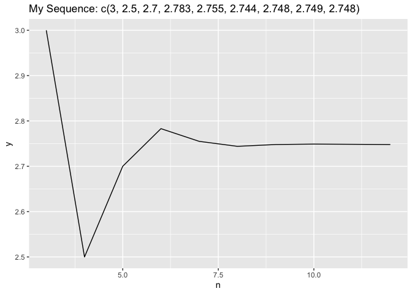

<!-- README.md is generated from README.Rmd. Please edit that file -->

# hw04pjaehee99

<!-- badges: start -->
<!-- badges: end -->

The goal of hw04pjaehee99 is to …

## Installation

You can install the released version of hw04pjaehee99 by asking me for
it.

## Example

This is a basic example which shows you how to solve a common problem:

``` r
library(hw04pjaehee99)
```

# Check Function 1

``` r
myseq_n(x=c(2,4,3), n= 3)
#> [1] 3
myseq_n(x=c(2,4,3), n= 4)
#> [1] 2.5
myseq_n(x=c(2,4,3), n= 5)
#> [1] 2.7
myseq_n(x=c(2,4,3), n= 6)
#> [1] 2.783333
myseq_n(x=c(2,4,3), n= 7)
#> [1] 2.754762
```

# Check Function 2

``` r
my_data <- tibble::tribble(
  ~x, ~y, ~z, ~n,
  2,4,3,3,
  2,4,3,4,
  2,4,3,5,
  2,4,3,6,
  2,4,3,7,
  2,4,3,8,
  2,4,3,9,
  2,4,3,10,
  2,4,3,12)

show_plot(my_data)
#> Warning in if (!(tibble::as_tibble(o))) stop("Do not meet requirements"): the
#> condition has length > 1 and only the first element will be used
#> Warning in if (!(as.integer(o[[4]]))) stop("Do not meet requirements"): the
#> condition has length > 1 and only the first element will be used
```


